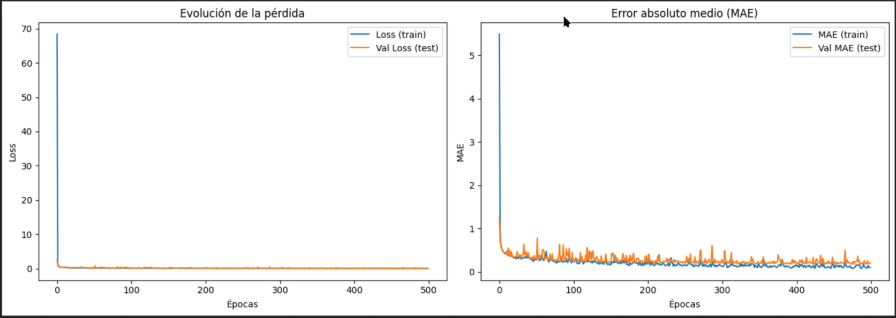
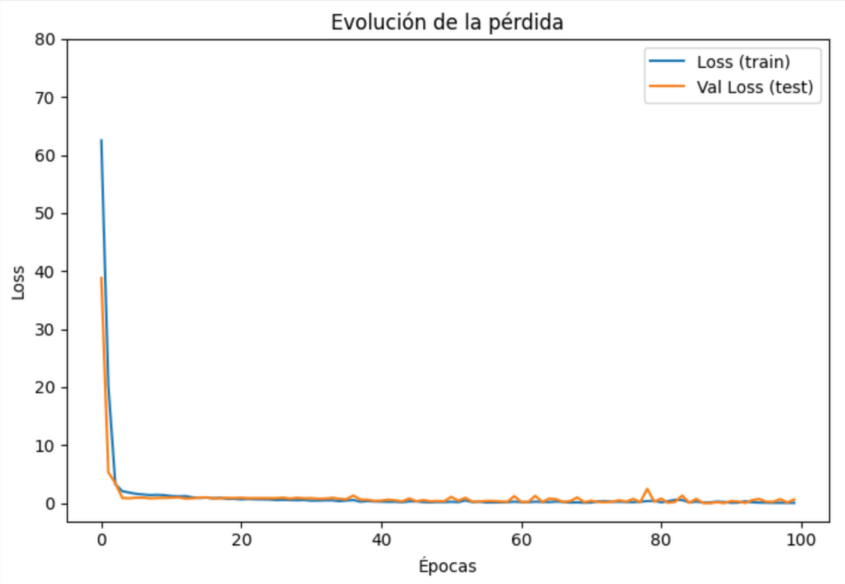
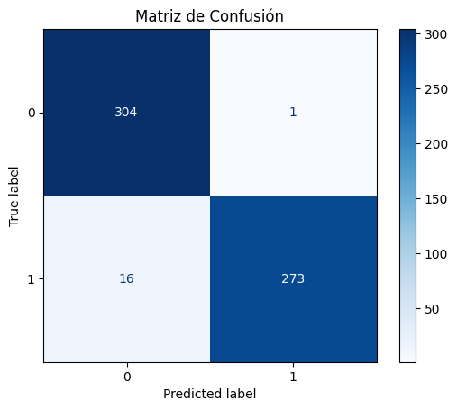

## Entrenamiento del Modelo

A continuación se muestra la evolución del rendimiento del modelo durante las 500 épocas de entrenamiento. El objetivo de esta red neuronal es predecir la temperatura de un sensor ubicado en otra habitación.

### 📈 Evolución de la pérdida y MAE

- **Izquierda – Pérdida (Loss)**:
  - La pérdida en entrenamiento y validación desciende rápidamente y se estabiliza en valores cercanos a cero.
  - Esto indica que el modelo aprende de manera eficiente sin signos evidentes de sobreajuste (*overfitting*).

- **Derecha – Error Absoluto Medio (MAE)**:
  - El MAE en entrenamiento y validación también disminuye rápidamente y se mantiene bajo.
  - Aunque la validación muestra ligeras fluctuaciones, el error sigue siendo bajo en general.
  - Esto sugiere que el modelo generaliza bien y realiza predicciones con una buena precisión.

### Conclusión

El modelo ha mostrado un comportamiento de aprendizaje sólido:
- Bajo error tanto en entrenamiento como en validación.
- Pocos o ningún indicio de sobreajuste.

## 📉 Pérdida durante el Entrenamiento del Modelo de Clasificación

La siguiente gráfica muestra la evolución de la pérdida del modelo durante el entrenamiento. Este modelo de red neuronal fue entrenado para clasificar si las ventanas deben abrirse (`1`) o permanecer cerradas (`0`).

### 🔁 Evolución de la pérdida

- La pérdida tanto en entrenamiento (`Loss train`) como en validación (`Val Loss test`) disminuye rápidamente en las primeras épocas.
- Después de aproximadamente 10 épocas, la pérdida se estabiliza alrededor de valores cercanos a **cero**, lo cual indica un aprendizaje exitoso del modelo.
- La diferencia entre la pérdida de entrenamiento y la de validación es mínima, lo cual **sugiere una buena generalización** y **ausencia de sobreajuste**.

### ✅ Conclusión

- El modelo logra aprender eficientemente a partir de los datos.
- Presenta un comportamiento estable y predecible en los datos de prueba.
- Esta evolución de la pérdida respalda los resultados positivos observados en la matriz de confusión del modelo.

## 🔍 Evaluación del Modelo de Clasificación

A continuación se muestra la **matriz de confusión** correspondiente a la evaluación del modelo de clasificación, el cual tiene como objetivo predecir si las ventanas deben abrirse (`1`) o mantenerse cerradas (`0`), en función de los datos recopilados.

### 📊 Matriz de Confusión

- **Clase 0 (ventanas cerradas)**:
  - Verdaderos negativos: **304**
  - Falsos positivos: **1**
- **Clase 1 (ventanas abiertas)**:
  - Falsos negativos: **16**
  - Verdaderos positivos: **273**

### Interpretación

- El modelo acierta la gran mayoría de veces en ambas partes.
- La precisión en predicción de ventanas cerradas es casi perfecta.
- Hay una pequeña cantidad de falsos negativos (cuando deberían abrirse pero no se predice correctamente).
- La **distribución está balanceada**, y la matriz indica un **buen rendimiento general** en la tarea de clasificación.

### Conclusión

Este modelo es altamente efectivo para predecir si las ventanas deben abrirse o cerrarse:
- Alta precisión.
- Muy bajo número de errores.
- Buen equilibrio entre sensibilidad y especificidad.
